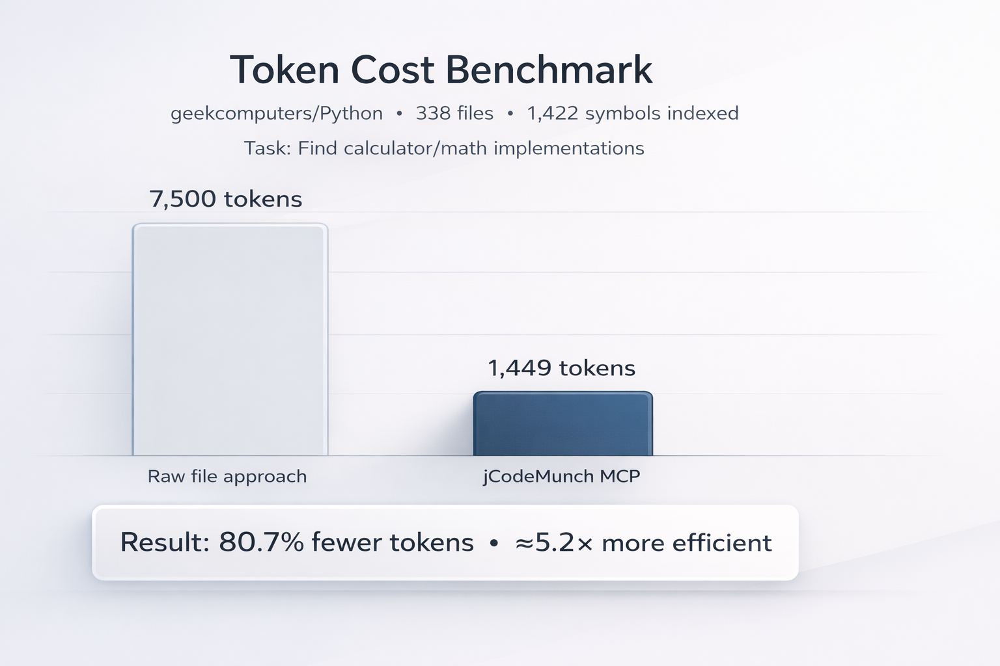

# jCodeMunch MCP
### Make AI agents cheaper and faster on real codebases


**Stop dumping files into context windows. Start retrieving exactly what the agent needs.**

jCodeMunch indexes a codebase once using tree-sitter AST parsing, then lets MCP-compatible agents (Claude Desktop, VS Code, etc.) **discover and retrieve code by symbol** instead of brute-reading files. Every symbol stores its signature + one-line summary, with full source retrievable on demand via O(1) byte-offset seeking.

> **Part of the Munch Trio** — see [The Munch Trio](#the-munch-trio) below for the full ecosystem including documentation indexing and unified orchestration.

---

## Proof first: Token savings in the wild

**Repo:** `geekcomputers/Python`
**Size:** 338 files, 1422 symbols indexed
**Task:** Find calculator/math implementations

| Approach | Tokens | What the agent had to do |
|---|---:|---|
| Raw file approach | ~7,500 | Open multiple files blindly and skim |
| jCodeMunch MCP | ~1,449 | `search_symbols(...)` -> `get_symbol(...)` |

### Result: **80.7% fewer tokens** (5.2x more efficient)

> Cost scales with tokens. Latency scales with "how much junk the model must read."
> jCodeMunch reduces both by turning *search* into *navigation*.



---

## Why agents need this

Agents waste money when they:
- open entire files just to find one function
- re-read the same code repeatedly
- drown in imports, boilerplate, and unrelated helpers

jCodeMunch gives agents **structured access**:
- **Search symbols** by name, kind, or language
- **Outline files** without loading full contents
- **Retrieve only the exact implementation** of a symbol
- **Full-text search** when symbol search misses (comments, TODOs, config)

Agents don't need more context. They need **precision context access**.

---

## How it works

1. **Discovery** -- files found via GitHub API or local directory walk
2. **Security** -- path traversal, secret detection, binary filtering, .gitignore
3. **Parsing** -- tree-sitter AST extraction across 6 languages
4. **Storage** -- JSON index + raw files in `~/.code-index/` (atomic writes)
5. **Retrieval** -- O(1) byte-offset seeking by stable symbol ID

### Stable Symbol IDs

```
{file_path}::{qualified_name}#{kind}
```
- `src/main.py::UserService.login#method`
- `src/utils.py::authenticate#function`

IDs are stable across re-indexing when file path, qualified name, and kind are unchanged.

---

## Installation

### Prerequisites

- **Python 3.10+**
- **pip** (or any Python package manager)

### Install

```bash
pip install git+https://github.com/jgravelle/jcodemunch-mcp.git
```

Verify:

```bash
jcodemunch-mcp --help 2>&1 | head -1   # should not error
```

### Configure MCP Client

#### Claude Code / Claude Desktop (claude_desktop_config.json)

**macOS/Linux** — `~/.config/claude/claude_desktop_config.json`
**Windows** — `%APPDATA%\Claude\claude_desktop_config.json`

```json
{
  "mcpServers": {
    "jcodemunch": {
      "command": "jcodemunch-mcp",
      "env": {
        "GITHUB_TOKEN": "ghp_...",
        "ANTHROPIC_API_KEY": "sk-ant-..."
      }
    }
  }
}
```

Both env vars are optional:
- **GITHUB_TOKEN** — enables private repos + higher GitHub API rate limits
- **ANTHROPIC_API_KEY** — enables AI-generated symbol summaries (falls back to docstrings/signatures without it)

#### Other MCP clients

Any MCP client that supports stdio transport can use jcodemunch-mcp. Point it at the `jcodemunch-mcp` command with the environment variables above.

### Verify

Once configured, ask your MCP client to list tools. You should see 11 tools.

### Usage

```
index_folder: { "path": "/path/to/project" }
index_repo:   { "url": "owner/repo" }

get_repo_outline: { "repo": "owner/repo" }
get_file_outline: { "repo": "owner/repo", "file_path": "src/main.py" }
search_symbols:   { "repo": "owner/repo", "query": "authenticate" }
get_symbol:       { "repo": "owner/repo", "symbol_id": "src/main.py::MyClass.login#method" }
search_text:      { "repo": "owner/repo", "query": "TODO" }
```

---

## Tools (11)

| Tool | Purpose |
|------|---------|
| `index_repo` | Index a GitHub repository |
| `index_folder` | Index a local folder (supports .gitignore, secret detection) |
| `list_repos` | List all indexed repositories |
| `get_file_tree` | Get repository file structure |
| `get_file_outline` | Get symbols in a file with hierarchy |
| `get_symbol` | Get full source of a symbol (with content verification) |
| `get_symbols` | Batch retrieve multiple symbols |
| `search_symbols` | Search symbols (filter by kind, language, file pattern) |
| `search_text` | Full-text search across indexed file contents |
| `get_repo_outline` | High-level repo overview (directories, languages, symbol counts) |
| `invalidate_cache` | Delete index and cached files for a repository |

All tool responses include a `_meta` envelope with timing and metadata.

---

## Supported Languages

| Language | Extensions | Symbol Types |
|----------|-----------|-------------|
| Python | `.py` | function, class, method, constant, type |
| JavaScript | `.js`, `.jsx` | function, class, method, constant |
| TypeScript | `.ts`, `.tsx` | function, class, method, constant, type |
| Go | `.go` | function, method, type, constant |
| Rust | `.rs` | function, type, class (impl), constant |
| Java | `.java` | method, class, type, constant |

See [LANGUAGE_SUPPORT.md](LANGUAGE_SUPPORT.md) for detailed per-language semantics.

---

## Security

Built-in security controls for indexing arbitrary codebases:

- **Path traversal prevention** -- all paths validated against repo root
- **Symlink escape protection** -- symlinks skipped by default
- **Secret file exclusion** -- `.env`, `*.key`, `*.pem`, etc. excluded automatically
- **Binary detection** -- extension + content sniffing to skip binary files
- **File size limits** -- 500KB per file (configurable)

See [SECURITY.md](SECURITY.md) for full details.

---

## What this is great for

- Large, messy repos where grepping is painful
- Agentic refactors across many files
- "Where is X implemented?" exploration
- Fast onboarding and architecture discovery
- Running cheaper agent swarms

## What this is not

- **Not a Language Server (LSP)** -- no real-time diagnostics or completions
- **Not a code editor** -- read-only indexing and retrieval
- **Not a file watcher** -- re-index manually or via tools
- **Not cross-repo search** -- each repository indexed independently
- **Not semantic analysis** -- extraction is purely syntactic via tree-sitter AST

---

## Environment Variables

| Variable | Purpose | Required |
|----------|---------|----------|
| `GITHUB_TOKEN` | GitHub API auth (higher rate limits, private repos) | No |
| `ANTHROPIC_API_KEY` | AI-powered symbol summarization via Claude Haiku | No |
| `CODE_INDEX_PATH` | Custom storage path (default: `~/.code-index/`) | No |

## Troubleshooting

| Problem | Cause | Fix |
|---------|-------|-----|
| Rate limits on GitHub API | No token configured | Set `GITHUB_TOKEN` for higher limits |
| Large repos only partially indexed | Default 500-file limit | Priority given to `src/`, `lib/`, `pkg/` |
| Encoding issues | Invalid UTF-8 in source files | Handled gracefully with replacement characters |
| Stale index | Source code changed since indexing | Use `invalidate_cache` to force clean re-index |
| `jcodemunch-mcp` command not found | Package not installed or not on PATH | Re-run `pip install` and check `which jcodemunch-mcp` |

---

## The Munch Trio

jCodeMunch is part of a three-package ecosystem for giving AI agents structured access to both code and documentation:

| Package | Purpose | Repo |
|---------|---------|------|
| **jcodemunch-mcp** (this repo) | Token-efficient code symbol indexing via tree-sitter AST parsing | 11 tools |
| [jdocmunch-mcp](https://github.com/jgravelle/jdocmunch-mcp) | Token-efficient documentation section indexing | 8 tools |
| [jcontextmunch-mcp](https://github.com/jgravelle/jcontextmunch-mcp) | Unified orchestration — hybrid search, context assembly, cross-references | 9 tools |

**Using all three?** You only need to configure [jcontextmunch-mcp](https://github.com/jgravelle/jcontextmunch-mcp) in your MCP client — it spawns jcodemunch-mcp and jdocmunch-mcp as subprocesses automatically. See the [jcontextmunch-mcp installation guide](https://github.com/jgravelle/jcontextmunch-mcp#full-installation-guide) for details.

---

## Documentation

- [USER_GUIDE.md](USER_GUIDE.md) -- Detailed usage guide with workflows and examples
- [ARCHITECTURE.md](ARCHITECTURE.md) -- Architecture, data flow, and design decisions
- [SPEC.md](SPEC.md) -- Full technical specification (tools, data models, algorithms)
- [SECURITY.md](SECURITY.md) -- Security controls and policies
- [SYMBOL_SPEC.md](SYMBOL_SPEC.md) -- Symbol ID format, kinds, and per-language rules
- [CACHE_SPEC.md](CACHE_SPEC.md) -- Cache storage, versioning, and invalidation
- [LANGUAGE_SUPPORT.md](LANGUAGE_SUPPORT.md) -- Supported languages and extension guide

## License

MIT
